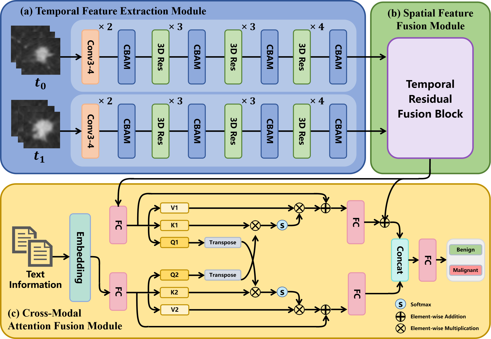
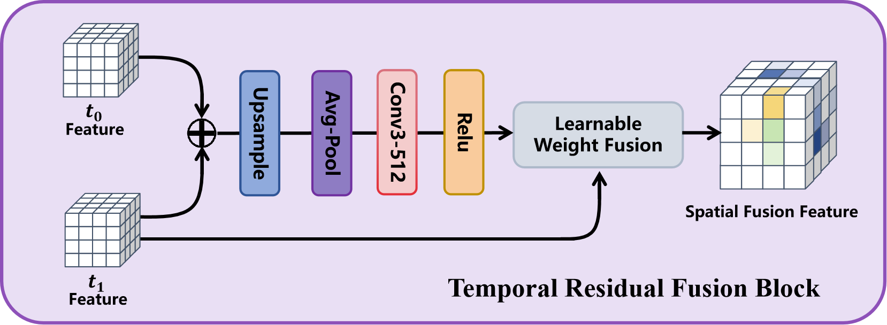

# CSF-net: Cross-Modal Spatiotemporal Fusion Network for Pulmonary Nodule Malignancy Predicting

## Proposed method
This code is a pytorch implementation of our paper "CSF-net: Cross-Modal Spatiotemporal Fusion Network for Pulmonary Nodule Malignancy Predicting".
It consists of three components: (a) spatial feature extraction module, (b) temporal residual fusion module, and (c) CMAF module.The spatial module combines ResNet with the CBAM for enhanced feature representation. The temporal residual fusion module integrates features from different time points to capture correlations. The CMAF module uses cross-modal attention to effectively integrate follow-up and clinical data.The figure below shows our proposed network.

## The Temporal Residual Fusion module in our method

